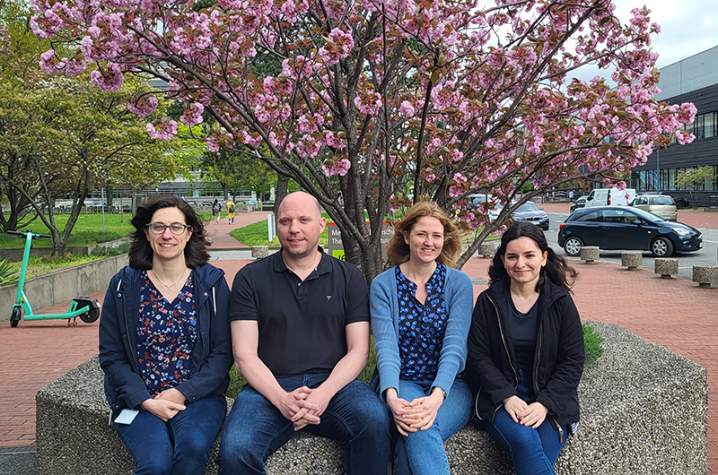

# Welcome to the Depledge Lab!
{: .display-4}
 
We are part of the [Institute of Virology](https://www.mhh.de/en/mhh-institutes/virology), at the [Hannover Medical School (MHH)](https://www.mhh.de/).
{: .welcomefont}

{:style="max-width: 100%; height: auto;"}

Research in the lab is focused on understanding how human herpesviruses persist following infection and how this is influenced by different aspects of RNA biology. 
{: .welcomefont}

